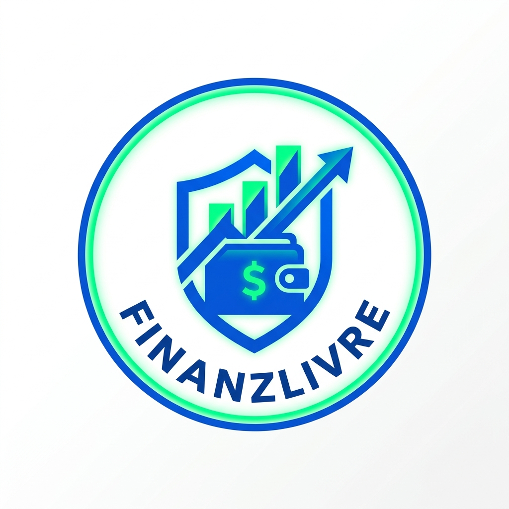

<p align="center">
  
</p>

<h1 align="center">💰 FinanzLivre - Gestão Financeira Pessoal</h1>

<p align="center">
  <strong>Controle total das suas finanças pessoais de forma 100% gratuita</strong>
</p>

<p align="center">
  <a href="#-features">Features</a> •
  <a href="#-demo">Demo</a> •
  <a href="#-tecnologias">Tecnologias</a> •
  <a href="#-instalação">Instalação</a> •
  <a href="#-contribuidores">Contribuidores</a>
</p>

<p align="center">
  
  
  
  
  
</p>

<p align="center">
  <a href="https://github.com/RomeraSCR/Gestao-de-Dividas/stargazers">
    
  </a>
  <a href="https://github.com/RomeraSCR/Gestao-de-Dividas/network/members">
    
  </a>
  <a href="https://github.com/RomeraSCR/Gestao-de-Dividas/issues">
    
  </a>
  <a href="https://github.com/RomeraSCR/Gestao-de-Dividas/blob/main/LICENSE">
    
  </a>
</p>

<br>

<p align="center">
  
</p>

## 📖 Sobre o Projeto

**FinanzLivre** é uma aplicação web moderna de gestão financeira pessoal e controle de gastos **100% gratuita**. Ela permite consolidar suas receitas, poupanças, despesas diárias, contas mensais e compras parceladas em um único lugar, sem a complexidade de planilhas.

### Por que usar?

- 🎯 **Sem planilhas** — Interface intuitiva para controle de receitas, gastos e metas
- 📊 **Visão de Saldo Real** — Saiba exatamente quanto sobrou no fim do mês
- 📈 **Metas e Poupança** — Organize quanto quer guardar e investir
- 💳 **Compras Parceladas** — Controle suas parcelas e histórico de pagamentos
- 📱 **PWA** — Instale no celular como um app nativo
- 🌙 **Dark Mode** — Interface elegante em modo claro ou escuro

<br>

## ✨ Features

<table>
<tr>
<td width="50%">

### 📋 Gestão de Dívidas
- Cadastro completo de compras parceladas
- Formulário em etapas (step-by-step)
- Valores fixos ou variáveis por parcela
- Acompanhamento de progresso visual

</td>
<td width="50%">

### 📅 Resumo Mensal
- Total a pagar por mês
- Clique no mês para ver detalhes
- Parcelas organizadas por vencimento
- Identificação visual de parcelas pagas

</td>
</tr>
<tr>
<td width="50%">

### 📜 Histórico de Parcelas
- Histórico completo por dívida
- Status de cada parcela (paga/pendente)
- Data de vencimento e pagamento
- Upload de comprovantes retroativo

</td>
<td width="50%">

### 🎨 Interface Moderna
- Design glassmorphism
- Animações suaves
- Totalmente responsivo
- Tour guiado para novos usuários

</td>
</tr>
</table>

<br>

## 🚀 Demo

Acesse a demonstração online:

🔗 **[dividas.neonproject.cloud](https://dividas.neonproject.cloud)**

> Use o botão "Ver Demo" para acessar com uma conta de demonstração.

<br>

## 🛠️ Tecnologias

### Frontend
| Tecnologia | Versão | Descrição |
|------------|--------|-----------|
| [Next.js](https://nextjs.org/) | 16.0 | Framework React com App Router |
| [React](https://react.dev/) | 19.2 | Biblioteca UI |
| [TypeScript](https://www.typescriptlang.org/) | 5.x | Tipagem estática |
| [Tailwind CSS](https://tailwindcss.com/) | 4.1 | Framework CSS utilitário |
| [Radix UI](https://www.radix-ui.com/) | Latest | Componentes acessíveis |
| [Lucide Icons](https://lucide.dev/) | Latest | Ícones SVG |

### Backend
| Tecnologia | Versão | Descrição |
|------------|--------|-----------|
| [MySQL](https://www.mysql.com/) | 8.0 | Banco de dados relacional |
| [bcryptjs](https://github.com/dcodeIO/bcrypt.js) | 2.4 | Hash de senhas |
| [jsonwebtoken](https://github.com/auth0/node-jsonwebtoken) | 9.0 | Autenticação JWT |

### Outros
| Tecnologia | Descrição |
|------------|-----------|
| [date-fns](https://date-fns.org/) | Manipulação de datas |
| [Zod](https://zod.dev/) | Validação de schemas |
| [Sonner](https://sonner.emilkowal.ski/) | Toast notifications |
| [next-themes](https://github.com/pacocoursey/next-themes) | Dark mode |

<br>

## 📦 Instalação

### Pré-requisitos

- Node.js 18+
- pnpm (recomendado) ou npm
- MySQL 8.0+

### Passo a passo

```bash
# Clone o repositório
git clone https://github.com/RomeraSCR/Gestao-de-Dividas.git

# Entre na pasta
cd Gestao-de-Dividas

# Instale as dependências
pnpm install

# Configure as variáveis de ambiente
cp env.example .env.local

# Execute as migrations do banco
mysql -u root -p < scripts/001_create_tables_mysql.sql

# Inicie o servidor de desenvolvimento
pnpm dev
```

### Variáveis de Ambiente

```env
# Banco de dados MySQL
DB_HOST=localhost
DB_USER=root
DB_PASSWORD=sua_senha
DB_NAME=gestao_dividas

# JWT Secret (gere uma chave segura)
JWT_SECRET=sua_chave_secreta_aqui

# URL do site (para OpenGraph)
NEXT_PUBLIC_SITE_URL=http://localhost:3536
```

<br>

## 📁 Estrutura do Projeto

```
gestao-dividas/
├── app/                    # App Router (Next.js 16)
│   ├── api/               # API Routes
│   ├── auth/              # Páginas de autenticação
│   ├── dashboard/         # Dashboard principal
│   └── page.tsx           # Landing page
├── components/            # Componentes React
│   ├── ui/               # Componentes base (shadcn/ui)
│   └── *.tsx             # Componentes da aplicação
├── lib/                   # Utilitários e configurações
│   ├── auth.ts           # Autenticação
│   ├── db.ts             # Conexão MySQL
│   └── money.ts          # Funções monetárias
├── public/               # Assets estáticos
├── scripts/              # Scripts SQL
└── styles/               # Estilos globais
```

<br>

## 🎯 Roadmap

- [x] Cadastro de dívidas com parcelas
- [x] Dashboard com estatísticas
- [x] Resumo mensal interativo
- [x] Histórico de parcelas
- [x] Upload de comprovantes
- [x] PWA (Progressive Web App)
- [x] Tour guiado para novos usuários
- [x] Dark mode
- [ ] Notificações de vencimento
- [ ] Exportar relatórios (PDF/Excel)
- [ ] Múltiplas contas por usuário
- [ ] Categorização de dívidas

<br>

## 👨‍💻 Contribuidores

<table>
  <tr>
    <td align="center">
      <a href="https://github.com/RomeraSCR">
        
        <br />
        <sub><b>Guilherme Romera</b></sub>
      </a>
      <br />
      <a href="https://github.com/RomeraSCR" title="GitHub">💻</a>
    </td>
    <td align="center">
      <a href="https://github.com/tatehira">
        
        <br />
        <sub><b>Nick Tatehira</b></sub>
      </a>
      <br />
      <a href="https://github.com/tatehira" title="GitHub">💻</a>
    </td>
  </tr>
</table>

<br>

## 📄 Licença

Este projeto está sob a licença MIT. Veja o arquivo [LICENSE](LICENSE) para mais detalhes.

<br>

---

<p align="center">
  Desenvolvido com 💙 por <a href="https://github.com/RomeraSCR">@RomeraSCR</a> e <a href="https://github.com/tatehira">@tatehira</a>
</p>

<p align="center">
  <a href="#-gestão-de-dívidas">⬆️ Voltar ao topo</a>
</p>
